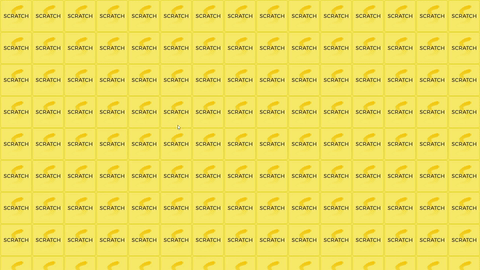
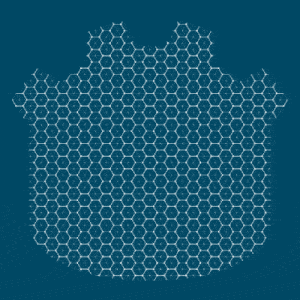
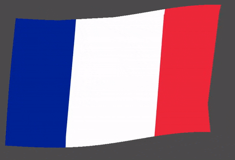

# Shaders experiments

<!-- 

  

-->

As I'm trying to learn shaders with Godot, I'm sharing them here for the community to use! You can also find most of them on [Godot shaders](https://godotshaders.com/author/mreliptik/)

If you want more Godot experiments, checkout my [Godot experiments](https://github.com/MrEliptik/godot_experiments).

## Structure

Every shader has its own folder with everything needed inside. 

This will probably duplicate some assets, but at least you know that if you want a particular shader, you can just copy its folder.

    .
    ├── 2D
    |   ├── game_of_life            # Load and stress tests
    │   ├── loading                 # loading effect color over grayscale
    │   ├── scratch_card            # scratch card effect
    │   ├── tiled_texture_in_mask   # tile a pattern inside a mask
    │   └── waving_flag             # 2D waving flag
    └── 3D                    
        ├── waving_flag             # 
        ├── xxxx                    # 
        └── xxxx                    #

## Shaders

Everything you need to know to use the different shaders.

## Images & GIFS

### Scratch card

  

### Tiling Shader

  

### Waving flag 2D

  

## About me

Software engineer & gamedev. 3D, 2D & VR. 

- [Discord](https://discord.gg/83nFRPTP6t)
- [YouTube](https://www.youtube.com/channel/UCANaLfiFwsHttGv6qGvSEIw)
- [Twitter](https://twitter.com/mreliptik_)
- [TikTok](https://www.tiktok.com/@mreliptik)
- [Instagram](https://www.instagram.com/_mreliptik)
- [Itch.io](https://mreliptik.itch.io/)

If you enjoyed this project and want to support me:

## LICENSE & Credits

This project is distributed under the MIT license, which it's free to use, modify and redistribute, for both personnal and commercial projects. For more information see [LICENSE.md](https://github.com/MrEliptik/shaders_experiments/blob/master/LICENSE).
